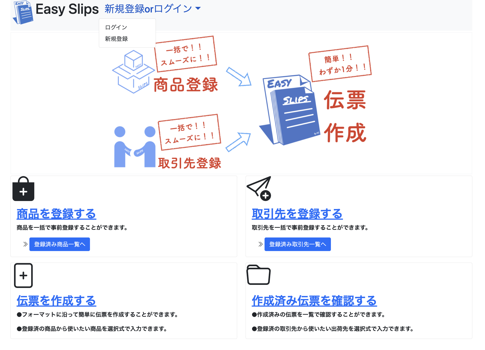
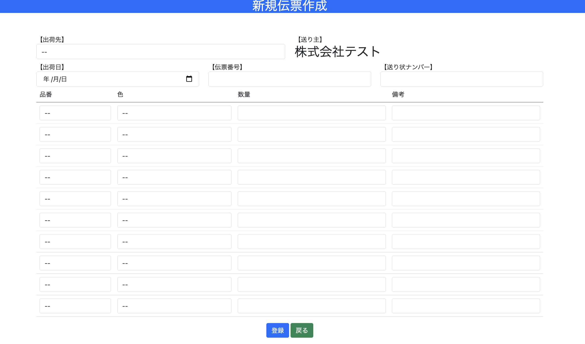
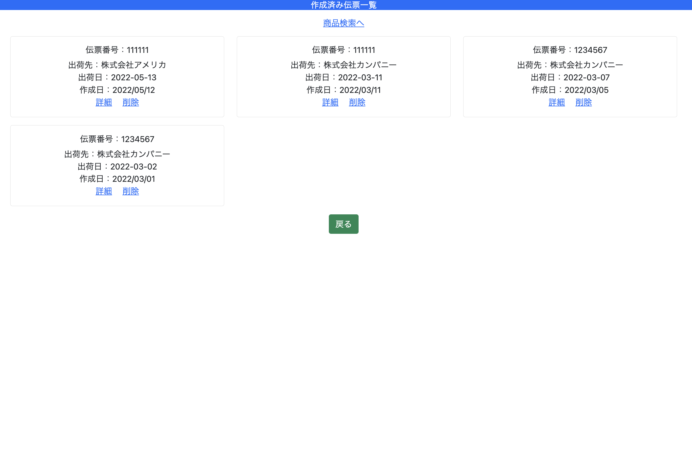

# アプリケーション名
【Easy Slips】
- 伝票作成を効率的に行うことができるアプリケーション

# アプリケーション概要
- アカウントを作成する
- 商品を登録する
- 取引先を登録する
- 伝票を作成し、PDF出力する

# URL
[Easy Slips -Heroku](https://easyslips.herokuapp.com/)

# テスト用アカウント
- ID:admin
- PW:2222

# 利用方法

## トップページ

- トップページ上部のメニューから「新規登録」、「ログイン」をする

## 商品登録ページ

- トップページの「商品登録ボタン」から商品登録ページへ遷移し、商品を一括で登録する。チェックボックスにチェックを入れた商品のみを一括で登録できる。

## 取引先登録ページ 

- トップページの「取引先登録ボタン」から取引先登録ページへ遷移し、取引先を一括で登録する。チェックボックスにチェックを入れた取引先のみを一括で登録できる。

## 伝票作成ページ

- トップページの「伝票作成ボタン」から伝票作成ページへ遷移し、伝票を作成する。(出荷先は「登録済み取引先」から、出荷商品は「登録済み商品」から選ぶことができる)

## 作成済み伝票一覧ページ

- トップページの「作成済み伝票一覧ボタン」から一覧ページへ遷移し、一覧で確認できる。

## 伝票詳細ページ

- 個別の詳細画面に遷移すると、詳細情報を確認できる。

## 伝票出力ページ

- 「PDF出力ボタン」を押すと、PDF形式で出力できる。印刷も可能。

## 伝票編集ページ

- 伝票は個別に「削除」、「編集」ができる

## 登録済み商品・取引先一覧ページ

- トップページから商品と取引先それぞれの登録済み一覧ページへ遷移し、個別に削除することもできる

# 制作背景(意図)
- 母親を対象ユーザーとしてアプリケーションを開発しようと考え、ヒアリングしたところ、「勤務先で毎日伝票を手作業で作っているが、非常に手間が掛かって面倒である」
  という問題点を見つけた。
- 解決したい課題として「伝票作成作業の効率化」を設定し、それを実現する手段として「伝票作成アプリケーション」を作成することにした。

# 実装した機能
- ユーザー管理機能(新規登録・ログイン)
- 商品登録機能(チェックボックスにチェックを入れた商品のみを一括で登録できる)
- 登録済み商品一覧表示機能(個別に削除も可能)
- 取引先登録機能(チェックボックスにチェックを入れた取引先のみを一括で登録できる)
- 登録済み取引先一覧表示機能(個別に削除も可能)
- 伝票作成機能(出荷先と出荷商品はそれぞれ登録済みの項目から選ぶことができる。出荷商品は10件まで入力可能。)
- 作成済み伝票一覧表示機能
- 伝票詳細表示機能
- 伝票編集機能
- 伝票削除機能
- 伝票出力機能(伝票詳細ページから個別にPDF出力できる)
- トップページ表示機能
- エラーメッセージの日本語化
- Basic認証の導入
- 伝票検索機能

# 工夫したポイント
- 「手入力が面倒である」というユーザーの声をもとに、伝票作成時、「出荷先」と「出荷商品」を毎回手入力しなくても済むように、「商品登録機能」と「取引先登録機能」において登録しておいた項目から選ぶことができるようにしたこと。
- 「取引先」と「商品」の入れ替わりが激しいというユーザーの勤務先での状況を踏まえ、一度に複数件を一括で登録できるようにし、また個別に削除もできるようにしたこと。
- ユーザーの勤務先の年齢層が高いという状況を踏まえ、フロントデザインをシンプルで分かりやすいものにしたこと。
- PDF出力した画面の見た目を整えやすくするため、視覚的な実装が行える「Thinreports」を導入したこと。
- エラーメッセージを日本語化し、誤った入力の際にも対処しやすくしたこと。

# 課題や今後実装した機能
- チャット機能を実装し、作成した伝票を共有、確認などできるようにしたい。

# データベース設計

## usersテーブル
| Column               | Type       | Options                        |
| ------               | ---------- | ------------------------------ |
| name                 | string     | null: false                    |
| email                | string     | null: false, unique: true      |
| encrypted_password   | string     | null: false                    |
| postal_code          | string     | null: false                    |
| prefecture_id        | integer    | null: false                    |
| city                 | string     | null: false                    |
| address              | string     | null: false                    |
| building_name        | string     |                                |
| phone_number         | string     | null: false                    |

### Association
- extend ActiveHash::Associations::ActiveRecordExtensions
- belongs_to :prefecture

## productsテーブル
| Column               | Type       | Options                        |
| ------               | ---------- | ------------------------------ |
| item_number          | integer    | null: false                    |
| name                 | string     | null: false                    |
| color                | string     | null: false                    |
| price                | integer    | null: false                    |
| note                 | string     | null: false                    |
| availability         | boolean    | null: false                    |

## clientsテーブル
| Column               | Type       | Options                        |
| ------               | ---------- | ------------------------------ |
| name                 | string     | null: false                    |
| availability         | boolean    | null: false                    |

## slipsテーブル
| Column               | Type       | Options                        |
| ------               | ---------- | ------------------------------ |
| address_name         | string     | null: false                    |
| slip_number          | integer    | null: false                    |
| shipping_date        | date       | null: false                    |
| invoice_number       | integer    |                                |

### Association
- has_many :orders
- accepts_nested_attributes_for :orders, allow_destroy: true

## ordersテーブル
| Column               | Type       | Options                        |
| ------               | ---------- | ------------------------------ |
| order_number         | integer    | null: false                    |
| color                | string     | null: false                    |
| count                | integer    | null: false                    |
| note                 | string     | null: false                    |
| slip_id              | references | null: false, foreign_key: true |

### Association
- belongs_to :slip

# 備考・参考にしたサイト
フロントサイド
- Bootstrap5公式ページ
  (https://getbootstrap.jp/)
- Bootstrapの導入レッスン
  (https://skillhub.jp/courses/168)
- Adobe Creative Cloud Express公式ページ
  (https://www.adobe.com/jp/express/create/logo)

サーバーサイド
- Thinreports公式ページ
  (https://www.thinreports.org/)
- Qiita(フォームからの一括登録機能の実装について)
  (https://qiita.com/kinop1987/items/63586892116446043365)
- Qiita(一つのフォームから複数のテーブルへの保存について)
  (https://qiita.com/koki_73/items/bc4ca80ab43e84d9704f)

